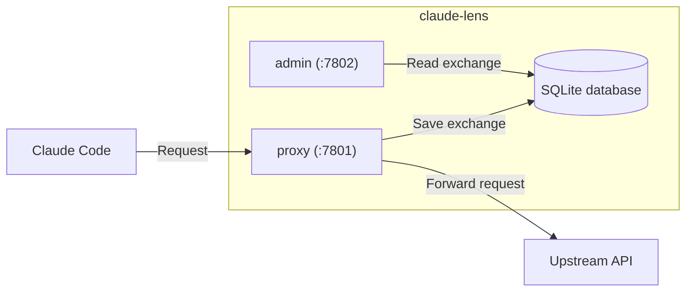

# About

A transparent HTTP proxy that sits between your Claude Code client and an upstream Anthropic API (by default) or another compatible proxy. Every request and response is captured and stored in a local SQLite database, giving you a full audit trail of prompts, completions, token usage, and cost across sessions — with a small admin dashboard to browse it.

`claude-lens` is a single static binary. It runs two HTTP servers concurrently in one process — a reverse proxy and an admin UI — sharing one in-process database connection and health flag.

It will add very little latency to your requests (since requests are buffered and only saved after completion), and is designed to be run locally on your machine. It does not require any external services or cloud infrastructure, and does not send any data to any cloud.

## Installation

### Env configuration

To route Claude Code traffic through `claude-lens`, set the `ANTHROPIC_BASE_URL` environment variable in your OS to `http://localhost:7801`.

```sh
export ANTHROPIC_BASE_URL=http://localhost:7801
```

#### Existing proxy

If you have another proxy already in use (e.g. LiteLLM), feed its envs to `CLENS_*` [environment variables](#environment-variables) like:

```sh
export CLENS_PROXY_BASE_URL=https://your.lite.llmproxy.com
export CLENS_PROXY_AUTH_TOKEN=your_token
export CLENS_PROXY_CUSTOM_HEADERS="X-My-Header: value"
```

### Install script

You can run the install script to download the latest release for your OS and architecture, and setup `claude-lens` as a background service.

Also use it to update an existing installation. It will overwrite the existing binary and merge any new configurations, but preserve your database and logs.

> This means that you can use the install script to update your configurations and/or the binary without losing your data.

You may provide flags to the install script to customize the Envs.

| Flag | Default | Points to Env |
|---|---|---|
| `--proxy-base-url` | `https://api.anthropic.com` | `CLENS_PROXY_BASE_URL` |
| `--proxy-auth-token` | — | `CLENS_PROXY_AUTH_TOKEN` |
| `--proxy-custom-header` | — | `CLENS_PROXY_CUSTOM_HEADERS` (repeatable) |
| `--proxy-addr` | `:7801` | `CLENS_PROXY_ADDR` |
| `--admin-addr` | `:7802` | `CLENS_ADMIN_ADDR` |
| `--install-dir` | `/usr/local/bin` (Linux), REQUIRED in (macOS) | |
| `--data-dir` | `/var/lib/claude-lens` | `CLENS_DATA_DIR` |
| `--log-dir` | `/var/log/claude-lens` | `CLENS_LOG_DIR` |
| `--as-service` | — | If set, will install as a system service (Linux) or launchd agent (macOS). |

#### Linux

To only install:

```sh
curl -sSL https://raw.githubusercontent.com/lfsc09/claude-lens/main/scripts/install_linux.sh | sudo bash
```

To install and run as a system service:

```sh
curl -sSL https://raw.githubusercontent.com/lfsc09/claude-lens/main/scripts/install_linux.sh | sudo bash -s -- --as-service
```

To provide custom configurations, use flags like:

```sh
curl -sSL https://raw.githubusercontent.com/lfsc09/claude-lens/main/scripts/install_linux.sh | sudo bash -s -- \
  --proxy-base-url https://api.anthropic.com \
  --proxy-auth-token sk-ant-your-token \
  --proxy-custom-header "X-My-Header: value" \
  --proxy-custom-header "X-Another-Header: value" \
  --proxy-addr :7801 \
  --admin-addr :7802 \
  --install-dir ~/claude-lens \
  --data-dir ~/claude-lens/data \
  --log-dir ~/claude-lens/logs
```

#### MacOS

To only install:

```sh
curl -sSL https://raw.githubusercontent.com/lfsc09/claude-lens/main/scripts/install_macos.sh | bash -s -- --install-dir ~/claude-lens
```

To install and run as a launchd agent:

```sh
curl -sSL https://raw.githubusercontent.com/lfsc09/claude-lens/main/scripts/install_macos.sh | bash -s -- --install-dir ~/claude-lens --as-service
```

### Manual install

You can also download the latest release binary straight from the [releases page](https://github.com/lfsc09/claude-lens/releases), and manually configure the environment variables (see below) to customize behaviour.

```sh
mkdir -p ~/claude-lens
```

```sh
curl -sSL "https://github.com/lfsc09/claude-lens/releases/latest/download/claude-lens-linux-amd64" -o ~/claude-lens/claude-lens-linux-amd64
```

```sh
chmod ug+x ~/claude-lens/claude-lens-linux-amd64
```

```sh
cd ~/claude-lens && ./claude-lens-linux-amd64
```

## Environment variables

All `claude-lens` configuration is via environment variables. They are all optional to customize behaviour.

They all must be set in OS environment. The `.env` file is only read in development builds (see [Getting started](#development-details)).

| Variable | Default | Description |
|---|---|---|
| `CLENS_PROXY_BASE_URL` | `https://api.anthropic.com` | Upstream API URL. Point this at a LiteLLM proxy or any other Anthropic-compatible endpoint. Replaces current `ANTHROPIC_BASE_URL` setting. |
| `CLENS_PROXY_AUTH_TOKEN` | — | If set, replaces the `Authorization` header on every forwarded request. Accepts a raw key or a full `Scheme token` value. Replaces current `ANTHROPIC_AUTH_TOKEN` setting. |
| `CLENS_PROXY_CUSTOM_HEADERS` | — | Extra headers injected into every forwarded request, one per line as `Header-Name: value`. Replaces current `ANTHROPIC_CUSTOM_HEADERS` setting. |
| `CLENS_PROXY_ADDR` | `:7801` | Proxy server listen address. |
| `CLENS_ADMIN_ADDR` | `:7802` | Admin server listen address. |
| `CLENS_DATA_DIR` | `data` | Where the SQLite database is created. |
| `CLENS_LOG_DIR` | `logs` | Where the rotating log file is written (5MB × 3 backups). |

## Data and Logs

The SQLite database is created in `CLENS_DATA_DIR` (default `data/`) and is named `claude-lens.db`.

Logs are written to `CLENS_LOG_DIR` (default `logs/`) in a rotating file named `claude-lens.log`. It rotates at 5MB and keeps 3 timestamped backups + 1 active log file - capping total log storage at 20MB.

## How it works



### Proxy interceptor

Only POST requests are intercepted (GET/PUT/DELETE pass through
untouched). For each one, the database records:

- Session ID (from `x-claude-code-session-id` or `x-session-id`) and
  session name (`x-session-name`, if set)
- The full message array sent by the client
- The assistant's response text
- `input_tokens`/`output_tokens`, plus `cache_creation_input_tokens`/
  `cache_read_input_tokens` (Anthropic prompt caching) reported by the
  upstream API, and the estimated cost for each token type
  (longest-matching-prefix against the `Prices` table, which prices cache
  writes/reads separately from plain input)
- The raw request and response bodies, for full-fidelity replay

Streaming responses are fully supported: each chunk is forwarded to the
client as it arrives (never buffered) while a copy is assembled for
storage once the stream completes.

</br>

# Development Details

**Prerequisites:** Go 1.26+.

## Installation

Clone the repository and `cd` into it.

```sh
git clone
cd claude-lens
```

Configure the commit hooks.

```sh
make install-hooks
```

Install dependencies.

```sh
go mod download
```

Create a `.env` file in the project root, based on `.env.example`, and fill in any values you want to override.

```sh
cp .env.example .env
```

## Running

Run the project in terminal. For hot reload on file changes, install [air](https://github.com/air-verse/air) once.

```sh
go install github.com/air-verse/air@latest
make dev
```

If you don't want hot reload, you can run it directly with `go run`:

> The `dev` build tag reads `.env` from the working directory on startup.

```sh
go run -tags dev ./cmd/claude-lens
```

Run tests.

```sh
go test ./...
```

Run with race detection (useful for debugging data races).

```sh
go test -race ./...
```
