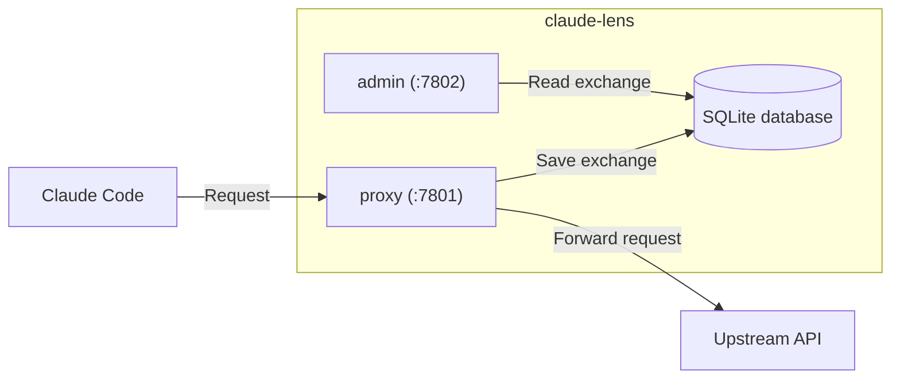

# claude-lens

### About

A transparent HTTP proxy that sits between a Claude Code client and an upstream Anthropic-compatible API. Every request and response is captured and stored in a local SQLite database, giving you a full audit trail of prompts, completions, token usage, and cost across sessions — with a small admin dashboard to browse it.

`claude-lens` is a single static binary. It runs two HTTP servers concurrently in one process — a reverse proxy and an admin UI — sharing one in-process database connection and health flag.

### How to use

To route Claude Code traffic through `claude-lens`, set the `ANTHROPIC_BASE_URL` environment variable to `http://localhost:7801`.

> If you have another proxy already in use (e.g. LiteLLM), put its URL in `CLENS_PROXY_BASE_URL` instead, and `claude-lens` will forward requests to it.
>
> Additional Envs like `ANTHROPIC_AUTH_TOKEN` or `ANTHROPIC_CUSTOM_HEADERS` must be replaced by `CLENS_PROXY_AUTH_TOKEN` and `CLENS_PROXY_CUSTOM_HEADERS`, respectively.

### `claude-lens` environment variables

All `claude-lens` configuration is via environment variables. They are all optional to customize behaviour.

They all must be set in OS environment (e.g. `export VAR=value` or a systemd unit's `Environment=`/`EnvironmentFile=`). The `.env` file is only read in development builds (see [Getting started](#getting-started)).

| Variable | Default | Description |
|---|---|---|
| `CLENS_PROXY_BASE_URL` | `https://api.anthropic.com` | Upstream API URL. Point this at a LiteLLM proxy or any other Anthropic-compatible endpoint. |
| `CLENS_PROXY_AUTH_TOKEN` | — | If set, replaces the `Authorization` header on every forwarded request. Accepts a raw key or a full `Scheme token` value. |
| `CLENS_PROXY_CUSTOM_HEADERS` | — | Extra headers injected into every forwarded request, one per line as `Header-Name: value`. |
| `CLENS_PROXY_ADDR` | `:7801` | Proxy server listen address. |
| `CLENS_ADMIN_ADDR` | `:7802` | Admin server listen address. |
| `CLENS_DATA_DIR` | `data` | Where the SQLite database is created. |
| `CLENS_LOG_DIR` | `logs` | Where the rotating log file is written (5MB × 3 backups). |

### Data and Logs

The SQLite database is created in `CLENS_DATA_DIR` (default `data/`) and is named `claude-lens.db`.

Logs are written to `CLENS_LOG_DIR` (default `logs/`) in a rotating file named `claude-lens.log`. It rotates at 5MB and keeps 3 timestamped backups + 1 active log file - capping total log storage at 20MB.

### How it works



#### Proxy interceptor

Only POST requests are intercepted (GET/PUT/DELETE pass through
untouched). For each one, the database records:

- Session ID (from `x-claude-code-session-id` or `x-session-id`) and
  session name (`x-session-name`, if set)
- The full message array sent by the client
- The assistant's response text
- `input_tokens`/`output_tokens`, plus `cache_creation_input_tokens`/
  `cache_read_input_tokens` (Anthropic prompt caching) reported by the
  upstream API, and the estimated cost for each token type
  (longest-matching-prefix against the `Prices` table, which prices cache
  writes/reads separately from plain input)
- The raw request and response bodies, for full-fidelity replay

Streaming responses are fully supported: each chunk is forwarded to the
client as it arrives (never buffered) while a copy is assembled for
storage once the stream completes.

</br>

# Development Details

**Prerequisites:** Go 1.26+.

### Installation

Clone the repository and `cd` into it.

```sh
git clone
cd claude-lens
```

Configure the commit hooks.

```sh
make install-hooks
```

Install dependencies.

```sh
go mod download
```

Create a `.env` file in the project root, based on `.env.example`, and fill in any values you want to override.

```sh
cp .env.example .env
```

### Running

Run the project in terminal. For hot reload on file changes, install [air](https://github.com/air-verse/air) once.

```sh
go install github.com/air-verse/air@latest
make dev
```

If you don't want hot reload, you can run it directly with `go run`:

> The `dev` build tag reads `.env` from the working directory on startup.

```sh
go run -tags dev ./cmd/claude-lens
```

Run tests.

```sh
go test ./...
```

Run with race detection (useful for debugging data races).

```sh
go test -race ./...
```
